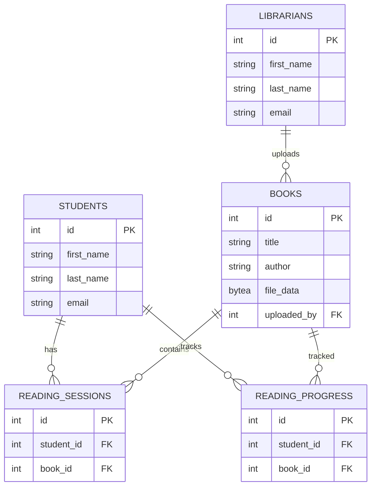

# LibMetrics — Project Defense Deck

---

## Title

LibMetrics — E-Library & Reading Intelligence

Presenter: <Your Name>
Date: <Defense Date>

---

## Agenda

- Project overview
- Architecture & data model
- Key features & flows
- Deployment & migrations
- Challenges & solutions
- Security & testing
- Defense Q&A

---

## Project Overview

- Purpose: A lightweight e-library for students and librarians.
- Users: Students (readers) and Librarians (uploaders / admins).
- Core features:
  - User registration and JWT auth
  - PDF upload (stored as BYTEA in DB)
  - Streaming download/view of PDFs
  - Reading sessions and progress tracking
  - Librarian dashboards & activity logs

---

## High-level Architecture

```mermaid
flowchart LR
  A[Browser (Static HTML/JS)] -->|REST| B[FastAPI Backend]
  B --> C[(PostgreSQL DB)]
  B --> D[Gunicorn + Uvicorn Worker]
  B --> E[Alembic Migrations]
```

Notes: Frontend is static Tailwind + vanilla JS. Backend exposes `/api/v1` endpoints and runs behind Gunicorn. Migrations run at startup.

---

## Database ER (simplified)



---

## Key API Endpoints (selected)

- `POST /api/v1/auth/login` — returns JWT
- `POST /api/v1/librarian/books` — multipart upload (title, author, file)
- `GET /api/v1/books` — list books
- `GET /api/v1/books/{id}/file` — stream PDF (application/pdf)
- `PATCH /api/v1/reading-progress/{book_id}` — update progress

---

## Upload & Download Flow

1. Librarian uploads via `/api/v1/librarian/books` (multipart). Backend validates PDF bytes in `app/services/files.py` and saves to `books.file_data`.
2. Student requests `/api/v1/books/{id}/file`. Backend streams bytes with `StreamingResponse` and `Content-Disposition: attachment`.

Code pointers: `app/services/books.py`, `app/services/files.py`, `app/api/v1/books.py`.

---

## Authentication & Security

- Passwords hashed with `bcrypt` (`app/core/security.py`).
- JWTs for stateless auth (token contains `sub`, `email`, `role`, `account_type`).
- Protected endpoints use `HTTPBearer` dependency and `get_current_user` (`app/core/deps.py`).
- Recommendations: enforce HTTPS, rotate secrets, tighten CORS.

---

## Deployment & Migrations

- `Dockerfile` + `entrypoint.sh` run `alembic upgrade head` then start Gunicorn.
- Env vars: `DATABASE_URL`, `JWT_SECRET`, `JWT_EXPIRY_MINUTES`.
- Render: add PostgreSQL service, set `DATABASE_URL`, deploy Docker image or use Dockerfile.

---

## Challenges & Solutions

- File storage: moved from filesystem (`file_path`) to DB `file_data` to avoid shared volume complications.
- Migration ordering: added `002_add_file_data` then `003_drop_file_path` to preserve upgrade order.
- Mobile responsiveness: updated Tailwind CSS and templates to avoid overflow and long-title truncation.

---

## Testing

- Integration tests in `backend/tests/test_integration.py`.
- Run tests: `./backend/scripts/run_tests.sh` (sets up sqlite tests by default).
- OpenAPI docs: `/api/docs` when server running.

---

## Defense Q&A (pick from these during defense)

1. Why FastAPI? — Fast development, async support, built-in OpenAPI.
2. Why store files in DB? — Simplicity and atomicity; tradeoffs: DB growth and performance.
3. How did you fix `file_path` migration issues? — Added migration to drop column and updated model; migrations run at startup.
4. How to improve scalability? — Move file storage to S3, add pagination, caching, and CDN.
5. How are JWTs secured? — Secret stored in env, short expiry; recommend refresh tokens.
6. What tests exist? — Integration tests covering main flows (registration, upload, download, reading sessions).
7. How to handle large file uploads? — Increase limit or use chunked uploads to object storage.
8. What would you change architecturally? — SPA frontend, object storage, stronger RBAC.
9. Failure modes? — DB size growth, slow downloads, long running migrations — mitigations outlined.
10. How is data integrity ensured? — FK constraints, unique indexes, transactions on write.

---

## Slide: Demo Plan

- Quick demo: register librarian → upload small PDF → list books → student open reader → show progress update.
- Commands (local):

```bash
# run backend
cd backend
./entrypoint.sh
# serve frontend
cd frontend/src
python3 -m http.server 8001
```

---

## Closing / Next Steps

- Add S3 integration and CDN for file serving.
- Convert frontend to SPA for improved UX.
- Add CI pipeline to run tests and build container images.

---

## Appendix: Helpful file references

- Backend main: `backend/app/main.py`
- Models: `backend/app/models/*.py`
- Services: `backend/app/services/*.py`
- Frontend: `frontend/src/*.html`, `frontend/src/app.js`, `frontend/src/input.css`


